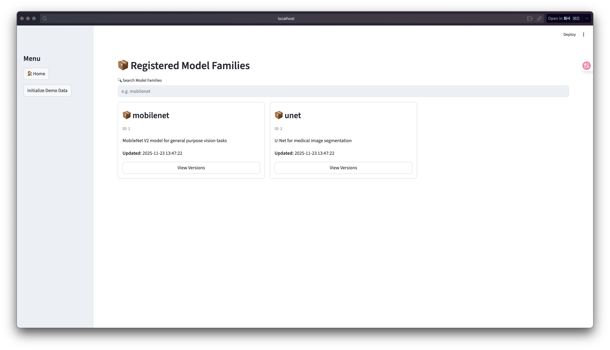
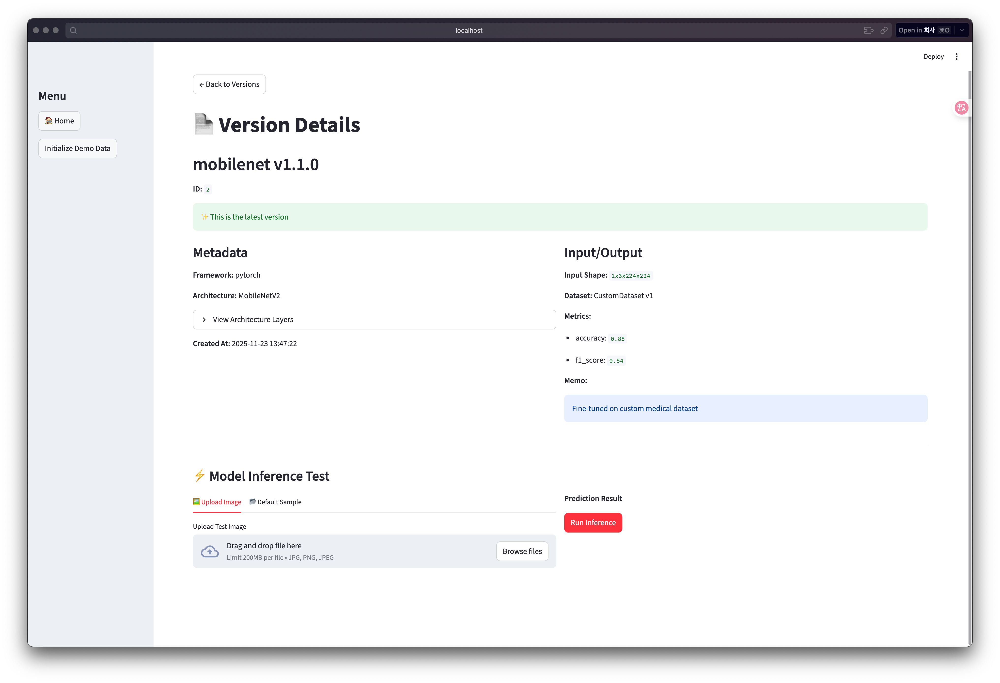
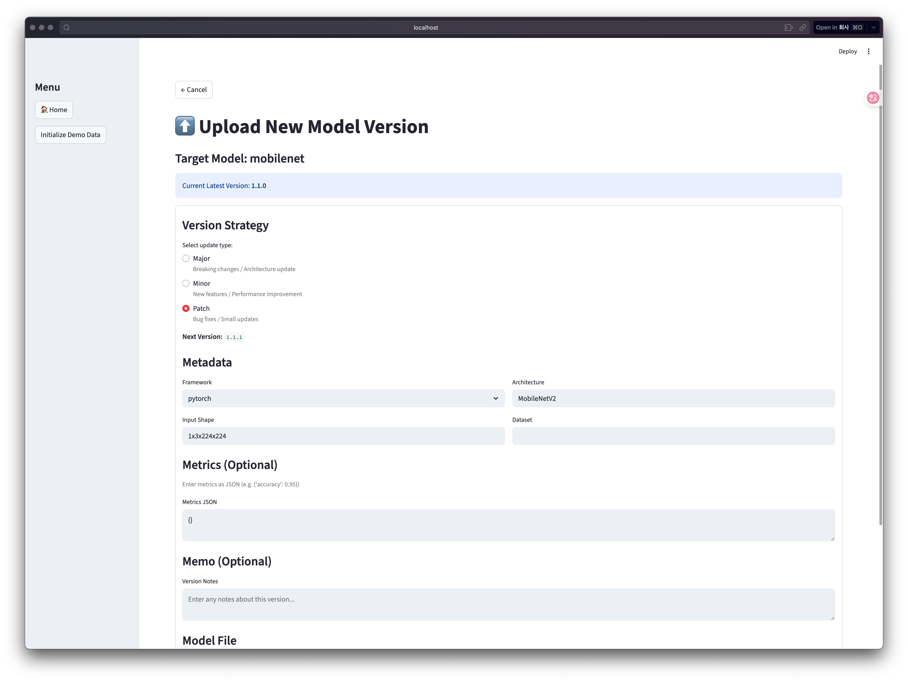

# AirsMed Model Registry - 사용 가이드 (User Guide)

이 문서는 AirsMed Model Registry 애플리케이션의 주요 기능과 사용 방법을 단계별로 안내합니다.

---

## 1. 메인 대시보드 (Main Dashboard)

애플리케이션을 실행하면 가장 먼저 보이는 화면입니다. 등록된 모델 패밀리 목록을 확인하고 검색할 수 있습니다.

*   **Model Family Search**: 상단의 검색창(`🔍 Search Model Families`)을 통해 원하는 모델을 이름으로 검색할 수 있습니다. (예: `mobilenet`, `unet`)
*   **Model List**: 등록된 모델 패밀리들이 카드 형태로 나열됩니다. 각 카드를 클릭하면 해당 모델의 상세 버전 목록으로 이동합니다.
*   **Navigation**: 왼쪽 사이드바를 통해 데모 데이터를 초기화하거나 앱의 주요 기능으로 이동할 수 있습니다.

---

## 2. 모델 버전 관리 (Model Versions)

특정 모델 패밀리(예: `mobilenet`)를 선택하면, 해당 모델의 모든 버전 이력을 볼 수 있는 화면으로 이동합니다.

*   **Version List**: 모델의 버전(`1.0.0`, `1.1.0` 등), 생성일, 간단한 메모를 확인할 수 있습니다.
*   **Latest Tag**: 가장 최신 버전에는 `(latest)` 태그가 표시되어 현재 프로덕션 버전을 쉽게 식별할 수 있습니다.
*   **New Version Button**: 우측 상단의 `New Version` 버튼을 클릭하여 새로운 모델 버전을 등록할 수 있습니다.
*   **Select Version**: 리스트에서 특정 버전을 클릭하면 해당 버전의 상세 정보 및 테스트 화면으로 진입합니다.

---

## 3. 버전 상세 및 추론 테스트 (Version Detail & Inference)

개별 버전을 선택했을 때의 상세 화면입니다. 메타데이터 확인과 모델 성능 테스트를 수행할 수 있습니다.

### A. 메타데이터 확인
*   **Metadata**: Framework, Input Shape, Dataset 정보와 성능 지표(Metrics)를 JSON 형태로 확인할 수 있습니다.
*   **Architecture**: `View Architecture Layers`를 펼치면 모델의 실제 레이어 구조(Layer-by-layer definition)를 텍스트로 검토할 수 있습니다.

### B. 추론 테스트 (Inference Test)
*   **Test Image**:
    *   기본 제공되는 `Sample Image`를 선택하여 즉시 테스트해볼 수 있습니다.
    *   `Upload Image` 옵션을 선택하여 사용자가 직접 보유한 의료 영상 이미지를 업로드할 수 있습니다.
*   **Run Inference**: `Run Inference` 버튼을 누르면 모델이 로드되고 예측 결과(Predicted Class, Confidence)가 실시간으로 표시됩니다.

---

## 4. 새 모델 버전 등록 (Upload New Version)

`New Version` 버튼을 클릭했을 때 나타나는 등록 양식입니다.

*   **Version Type**: `Major`, `Minor`, `Patch` 중 업데이트 유형을 선택하면 다음 버전 번호가 자동으로 계산됩니다. (예: `1.0.0` -> `1.1.0`)
*   **Model File**: 학습된 PyTorch 모델 파일(`.pth`)을 업로드합니다.
*   **Metadata Input**:
    *   `Architecture`: 모델 구조 이름 (예: `MobileNetV2`)
    *   `Input Shape`: 입력 이미지 크기 (예: `1x3x224x224`)
    *   `Dataset`: 학습에 사용된 데이터셋 이름
    *   `Metrics`: 정확도 등의 성능 지표 (JSON 형식 권장)
    *   `Memo`: 해당 버전에 대한 변경 사항이나 메모
*   **Register**: 모든 정보를 입력하고 `Register Version` 버튼을 누르면 모델이 저장되고 버전 목록에 추가됩니다.
* 업로드 테스트용 모델은 assets/models 에 있습니다.
