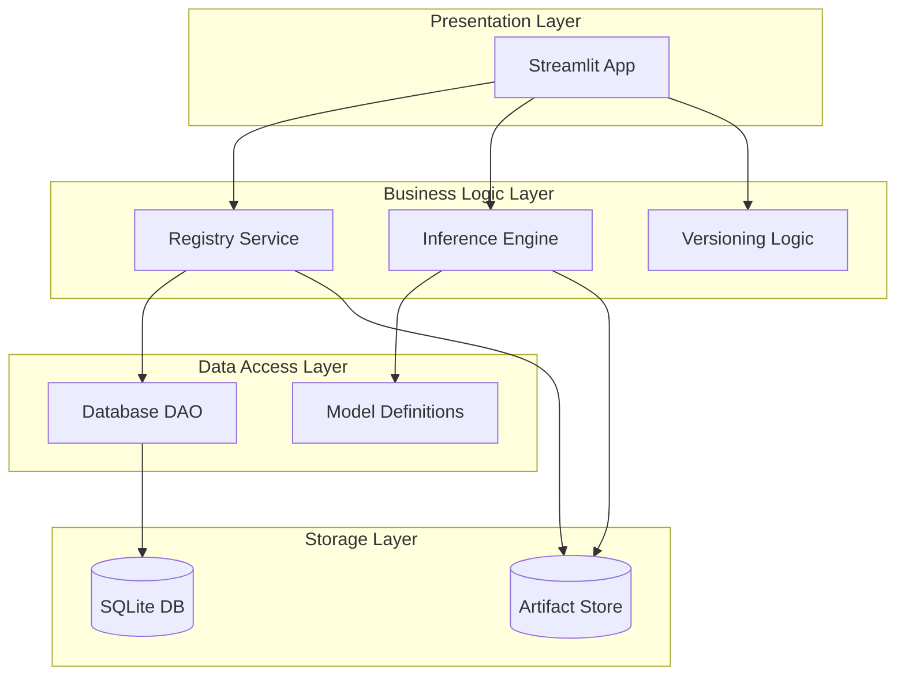

# System Design Document

## 1. 배경 조사 (Background Research)

### A. 해결하고자 하는 문제 (Problem Statement)
머신러닝 프로젝트가 발전함에 따라 다음과 같은 문제들이 발생합니다:
1.  **모델 버전 관리의 부재**: 파일명을 `model_v1.pth`, `model_final.pth` 등으로 수동 관리하여 이력 추적이 어렵습니다.
2.  **메타데이터 파편화**: 모델의 학습 데이터, 성능 지표(Accuracy, Loss), 하이퍼파라미터가 실험 노트나 별도 문서에 흩어져 있어 모델 파일과 매칭하기 어렵습니다.
3.  **재현성 부족**: 특정 시점의 모델이 어떤 환경과 코드에서 생성되었는지 파악하기 어렵습니다.
4.  **배포 프로세스의 복잡성**: 최신 모델을 프로덕션에 배포할 때, 어떤 파일이 검증된 "Latest" 버전인지 식별하기 모호합니다.

**모델 레지스트리**는 이러한 문제를 해결하기 위해 모델의 저장, 버전 관리, 메타데이터 추적, 배포 상태 관리를 중앙화된 시스템에서 수행합니다.

### B. 기존 솔루션의 디자인 패턴 벤치마킹 (Benchmarking)
본 프로젝트는 **MLflow**와 **HuggingFace Hub**의 핵심 디자인 패턴을 참고하여 경량화된 형태로 구현했습니다.

*   **MLflow Model Registry**:
    *   **중앙화된 저장소**: 모델 아티팩트와 메타데이터를 분리하여 관리하는 구조를 차용했습니다.
    *   **Model Stages**: 모델의 라이프사이클(Staging -> Production -> Archived) 관리 개념을 참고하여 "Latest" 태그 기능을 구현했습니다.
*   **HuggingFace Hub**:
    *   **Model Card**: 모델의 설명, 사용법, 성능 지표를 문서화하여 보여주는 UI/UX를 벤치마킹했습니다.
    *   **Inference API**: 웹상에서 모델을 즉시 테스트해볼 수 있는 기능을 참고하여 "Model Inference Test" 섹션을 구현했습니다.

---

## 2. 아키텍처 다이어그램 (Architecture Diagram)
시스템의 주요 구성 요소와 상호작용을 시각화한 다이어그램입니다.

## 2. 핵심 구성 요소 (Key Components)

### A. Presentation Layer (UI)
*   **`app.py` (Streamlit)**: 사용자와 상호작용하는 웹 인터페이스입니다.
    *   **책임**: 모델 목록 조회, 검색, 상세 정보 표시, 모델 업로드, 추론 테스트 UI 제공.
    *   **특징**: 계층형 네비게이션(Model Family -> Versions -> Detail) 및 실시간 상태 관리(`st.session_state`).

### B. Business Logic Layer (Service)
*   **`src/registry.py` (Registry Service)**: 모델 관리의 핵심 비즈니스 로직을 담당합니다.
    *   **책임**: DB 데이터 조회 및 가공(DataFrame 변환), UI 표시용 데이터 구조화.
*   **`src/inference.py` (Inference Engine)**: 모델 로딩 및 추론을 수행합니다.
    *   **책임**: 모델 아키텍처 동적 로딩, `.pth` 파일 로드(Fallback 경로 지원), 이미지 전처리 및 예측 실행.
*   **`src/versioning.py`**: 시맨틱 버저닝 로직을 처리합니다.
    *   **책임**: Major/Minor/Patch 업데이트에 따른 차기 버전 번호 자동 계산.

### C. Data Access Layer (DAO)
*   **`database/sqlite.py`**: 데이터베이스 CRUD 작업을 전담합니다.
    *   **책임**: `models`, `model_versions`, `artifacts` 테이블에 대한 Insert/Select 쿼리 실행, 트랜잭션 관리.

### D. Storage Layer
*   **SQLite DB**: 메타데이터(이름, 버전, 메트릭, 설명 등)를 저장하는 관계형 데이터베이스입니다.
*   **Artifact Store**: 실제 모델 가중치 파일(`.pth`)이 저장되는 파일 시스템 경로(`artifacts/`)입니다.

---

## 3. 디자인 결정 (Design Decisions)

### 저장 전략 (Storage)
*   **전략**: **메타데이터와 아티팩트의 분리 저장** 방식을 채택했습니다. 메타데이터는 SQLite에 구조화하여 저장하고, 대용량 바이너리 파일(모델 가중치)은 파일 시스템에 저장하여 DB 부하를 줄이고 I/O 효율을 높였습니다.
*   **구조**: `artifacts/{model_name}/{uuid}/model.pth` 형식을 사용합니다. UUID를 도입하여 동일 버전 재업로드 시 파일명 충돌을 방지하고 고유성을 보장했습니다.

### 버전 관리 (Versioning)
*   **전략**: **Semantic Versioning (Major.Minor.Patch)** 체계를 도입했습니다.
    *   `Major`: 호환되지 않는 변경 (아키텍처 변경 등)
    *   `Minor`: 기능 추가 및 성능 개선 (Backwards-compatible)
    *   `Patch`: 버그 수정 및 미세 조정

### 기술 선택 (Technology Stack)
*   **Database: SQLite**
    *   **선택 이유**: 별도의 서버 설치가 필요 없는 **Serverless** 구조로, 로컬 개발 및 소규모 배포에 최적화되어 있습니다. 파일 하나로 데이터 이동이 간편하여 과제 제출 및 테스트 환경에 적합합니다.
    *   **Trade-off**: 동시 접속 처리에 한계가 있을 수 있으나, 현재 단일 사용자/소규모 팀 사용 시나리오에서는 충분한 성능을 제공합니다.
*   **Model Loading: Dynamic Import**
    *   **선택 이유**: 새로운 모델 아키텍처 추가 시 코드를 수정하지 않고도 확장 가능하도록 유연성을 확보했습니다.

### 고려한 트레이드오프 (Trade-offs)

*   **모놀리식(Monolithic) vs 모듈화(Modular) 아키텍처**:
    *   **선택**: 3-Tier 아키텍처(UI-Service-DAO)로 모듈화하여 역할을 명확히 분리했습니다.
    *   **고려사항**: 초기에는 단일 파일(app.py)에 모든 로직을 넣는 것이 빠르게 동작하는 프로토타입을 만들기엔 유리했지만, 코드 가독성과 유지보수성이 급격히 나빠질 우려가 있었습니다. 따라서 `database/sqlite.py`(CRUD), `src/registry.py`(비즈니스 로직), `app.py`(UI)로 분리하여 각 모듈이 명확한 책임을 갖도록 설계했습니다.

*   **CLI(Command Line Interface) vs GUI(Graphic User Interface)**:
    *   **선택**: Streamlit을 이용한 **GUI 중심의 접근**을 선택했습니다.
    *   **고려사항**: 개발자 친화적인 CLI 도구(예: `python registry.py register ...`)를 만드는 것이 자동화 파이프라인(CI/CD)에는 더 유리할 수 있습니다. 하지만 본 프로젝트의 목표는 다양한 이해관계자(PM, 비개발자 등)가 모델을 쉽게 확인하고 테스트하는 것이므로, 직관적인 **웹 인터페이스 제공**을 최우선으로 했습니다.

*   **버전 관리 자동화**:
    *   **선택**: 사용자가 Major/Minor/Patch만 선택하면 다음 버전 번호가 자동으로 계산되도록 구현했습니다.
    *   **고려사항**: 사용자가 직접 `1.2.3` 형식으로 버전을 입력하게 할 수도 있었지만, 오타나 중복 버전 등의 휴먼 에러를 방지하기 위해 시스템이 DB에서 최신 버전을 조회하고 자동 증가시키는 **휴먼 에러 최소화** 전략을 택했습니다.

---

## 4. 데이터 흐름 (Data Flow)

### 시나리오 1: 모델 등록 (Registration Flow)
1.  **User Input**: 사용자가 UI에서 파일 업로드 및 메타데이터(Metrics, Memo 등) 입력, 버전 타입(Major/Minor/Patch) 선택.
2.  **Version Calculation**: `src/versioning.py`가 DB의 최신 버전을 확인하여 새 버전 번호 생성 (예: 1.0.0 -> 1.1.0).
3.  **File Save**: `app.py`가 업로드된 파일을 `artifacts/{model_name}/{uuid}/model.pth` 경로에 저장.
4.  **DB Insert**: `database/sqlite.py`가 메타데이터와 파일 경로를 트랜잭션으로 DB에 저장 (`models` -> `artifacts` -> `model_versions` 순서).

### 시나리오 2: 모델 조회 및 추론 (Inference Flow)
1.  **User Selection**: 사용자가 대시보드에서 특정 모델 버전 선택.
2.  **Data Fetch**: `src/registry.py`가 DB에서 해당 버전의 메타데이터와 파일 경로(`rel_path`) 조회.
3.  **Path Resolution**: `src/inference.py`가 `artifacts/` 또는 `FALLBACK_PATH`에서 실제 파일 존재 여부 확인.
4.  **Model Load**: `models/{model_name}.py`의 아키텍처 정의와 `.pth` 가중치를 결합하여 PyTorch 모델 객체 생성.
5.  **Inference**: 입력 이미지를 전처리하여 모델에 주입하고, 결과(확률, 클래스)를 UI에 반환.
